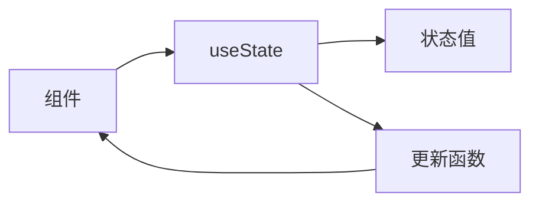

# Markdown Illustrator

> 为 Markdown 文章自动生成配图的智能系统

[](https://www.python.org/)
[](LICENSE)
[](VERSION)

---

## 核心特性

### 智能配图
- 自动解析文章结构（标题、段落、代码块）
- 智能识别文档类型，选择最优配图方案
- LLM 驱动的精准提示词生成

### 多样化图片来源
| 来源 | 类型 | 费用 | 适用场景 |
|-----|------|------|---------|
| **auto** | 智能选择 | 混合 | 推荐使用 |
| **mermaid** | 技术图表 | 免费 | 技术文档、流程图 |
| **unsplash/pexels** | 图库 | 免费 | 普通文档、真实照片 |
| **zhipu** | AI 生成 | ¥0.06/张 | 中文文章、封面图 |
| **doubao** | AI 生成 | ¥0.005/张 | 成本敏感 |
| **flux** | AI 生成 | ¥0.01/张 | 质量优先 |
| **dalle** | AI 生成 | ¥0.4/张 | 最高质量 |

### 批量与增量
- 批量生成候选图，解决 AI 效果不稳定问题
- 增量更新，只重新生成指定图片
- 支持按类型重新生成（封面/章节/概念图等）

### Web 交互界面
- 实时预览 Markdown 渲染效果
- 可视化选择候选图
- 在线编辑和导出
- 多用户支持（v1.8）

---

## 快速开始

### 安装

```bash
# 克隆项目
git clone https://github.com/your-repo/markdown_illustrator.git
cd markdown_illustrator

# 安装依赖
pip install -r requirements.txt
```

### 配置

1. 复制环境变量模板：
```bash
cp .env.example .env
```

2. 编辑 `.env` 文件，添加 API Key：
```bash
# 智谱AI（推荐用于智能模式和LLM提示词生成）
ZHIPUAI_API_KEY=your_zhipuai_api_key

# 其他可选配置
OPENAI_API_KEY=your_openai_key
ARK_API_KEY=your_ark_key
```

### 基本使用

```bash
# 智能模式（推荐）
python mi.py article.md

# 指定图片来源
python mi.py article.md --source mermaid   # 免费技术图表
python mi.py article.md --source unsplash  # 免费图库
python mi.py article.md --source zhipu     # AI生成

# 批量生成候选图
python mi.py article.md --batch 3

# 只重新生成第2张图片
python mi.py article.md --regenerate 1
```

---

## 工作原理

```
┌─────────────────────────────────────────────────────────────────┐
│                        配图流程                                  │
├─────────────────────────────────────────────────────────────────┤
│                                                                 │
│  1. 解析 Markdown                                              │
│     └─> 提取标题、段落、代码块等结构                            │
│                                                                 │
│  2. 分析内容                                                    │
│     ├─> 判断配图位置（H1后、H2后、长段落）                     │
│     └─> 决定图片类型（cover、section、concept等）               │
│                                                                 │
│  3. 智能模式 (auto)                                            │
│     ├─> 文档分类 → 技术文档 vs 普通文档                        │
│     ├─> 来源选择 → Mermaid / 图库 / AI                         │
│     └─> 提示词生成 → LLM 智能生成精准描述                      │
│                                                                 │
│  4. 生成图片                                                    │
│     └─> 调用对应 API 生成图片并保存                            │
│                                                                 │
│  5. 重组 Markdown                                               │
│     └─> 将图片插入到合适位置                                   │
│                                                                 │
└─────────────────────────────────────────────────────────────────┘
```

---

## 命令行参数

| 参数 | 说明 | 示例 |
|-----|------|------|
| `--source` | 图片来源 | `--source auto` |
| `--batch` | 批量生成数量 | `--batch 3` |
| `--regenerate` | 重新生成指定索引 | `--regenerate 0` |
| `--regenerate-type` | 按类型重新生成 | `--regenerate-type cover` |
| `--dry-run` | 只分析不生成 | `--dry-run` |
| `--debug` | 调试模式 | `--debug` |
| `-o` | 输出文件 | `-o output.md` |

---

## 图片类型与规则

### 图片类型

| 类型 | 位置 | 说明 |
|-----|------|------|
| `cover` | H1 标题后 | 文章封面图 |
| `section` | H2 标题后 | 章节配图 |
| `concept` | 概念段落后 | 概念示意图 |
| `atmospheric` | 长段落后 | 氛围插图 |
| `diagram` | 技术内容 | 架构图/流程图 |
| `code_concept` | 代码块前 | 代码结构图 |

### 配图规则

编辑 `config/settings.yaml` 自定义规则：

```yaml
rules:
  h1_after: true                 # H1后配图
  h2_after: "smart"              # H2后智能判断
  long_paragraph_threshold: 150   # 长段落阈值
  min_gap_between_images: 3       # 图片最小间隔
  max_images_per_article: 10      # 最大配图数
```

---

## 智能模式详解

智能模式 (`--source auto`) 是推荐的使用方式：

### 工作流程

1. **文档分类**
   - 代码块数量（+40分）
   - 技术关键词（+30分）
   - 流程关键词（+20分）
   - 结构化程度（+10分）
   - ≥30分 → 技术文档

2. **来源选择**
   - 技术文档 + 章节/概念图 → **Mermaid**
   - 普通文档 + 章节/概念图 → **Unsplash**
   - 任何类型 + 封面图 → **AI (zhipu)**

3. **提示词生成**
   - 使用 glm-4-flash 分析内容
   - 生成精准的中文提示词
   - 结合规则模板优化

### 效果示例

```markdown
# 输入：技术文档

## React Hooks 深入理解

useState 用于状态管理...

# 输出

## React Hooks 深入理解



useState 用于状态管理...
```

---

## Mermaid 技术图表

完全免费的技术图表生成：

### 支持的图表类型

```bash
# 流程图
python mi.py article.md --source mermaid

# 自动检测图表类型
# - flowchart: 流程图
# - sequence: 时序图
# - class: 类图
# - state: 状态图
# - er: ER图
# - mindmap: 思维导图
```

---

## 批量生成工作流

解决 AI 生成效果不稳定的核心方案：

### 完整流程

```bash
# 1. 首次生成，每个位置3张候选图
python mi.py article.md --batch 3 --source auto

# 2. 预览所有候选图
# 文件命名格式：0_cover_20250120_000.png（第1张）
#              0_cover_20250120_001.png（第2张）
#              0_cover_20250120_002.png（第3张）

# 3. 选择最满意的候选图
# 编辑 article.md，取消注释选中的图片

# 4. 对不满意的位置重新生成
python mi.py article.md --regenerate 2 --batch 5
```

---

## Web 交互界面

### 启动方式

```bash
# 单用户模式
python src/web_server.py

# 多用户模式（v1.8）
./start_server.sh dev    # 开发模式
./start_server.sh prod   # 生产模式
```

### 功能

- **实时预览**：Markdown 渲染 + Mermaid 图表
- **候选图选择**：可视化选择最佳图片
- **在线编辑**：直接修改内容并保存
- **图片来源选择器**：支持 8 种图片来源切换
- **多用户支持**：登录认证 + 会话隔离

---

## 多用户部署 (v1.8)

适合企业内部团队使用（10-50人）：

### 主要特性

| 功能 | 说明 |
|-----|------|
| 用户认证 | 用户名/密码登录 |
| 会话隔离 | 每个用户独立工作空间 |
| 文件隔离 | 会话级临时目录 |
| 速率限制 | 防误操作保护 |
| 配额管理 | 每日配图次数限制 |

### 快速部署

```bash
# 开发模式
./start_server.sh dev

# 生产模式（Gunicorn多进程）
./start_server.sh prod

# 自定义端口
./start_server.sh dev 8000
```

### 用户配置

编辑 `config/users.yaml`：

```yaml
users:
  admin:
    password: admin123
    name: 管理员
    role: admin
    quota_limit: 1000

  user1:
    password: user123
    name: 张三
    role: user
    quota_limit: 50
```

**默认账户**: admin / admin123

**详细文档**: [docs/MULTI_USER_DEPLOYMENT.md](docs/MULTI_USER_DEPLOYMENT.md)

---

## 配置文件

### settings.yaml 结构

```yaml
# 默认图片来源
image_source: auto

# API 配置
api:
  api_key: ""
  model: cogview-4
  timeout: 60

# 图片配置
image:
  size: 1024x1024
  save_dir: output/images

# 配图规则
rules:
  h1_after: true
  h2_after: "smart"
  long_paragraph_threshold: 150
  min_gap_between_images: 3
  max_images_per_article: 10

# LLM 配置
llm:
  enabled: true
  provider: zhipu
  model: glm-4-flash

# Mermaid 配置
mermaid:
  render_mode: code
  default_diagram_type: flowchart
  auto_detect_type: true
```

---

## 项目结构

```
markdown_illustrator/
├── src/
│   ├── main.py                  # 主入口
│   ├── parser.py                # Markdown解析
│   ├── analyzer.py              # 内容分析
│   ├── classifier.py            # 文档分类
│   ├── prompt_generator.py      # LLM提示词生成
│   ├── image_source_manager.py  # 图片源管理
│   ├── image_gen.py             # 图片生成工厂
│   ├── zhipu_gen.py             # 智谱AI实现
│   ├── doubao_gen.py            # 豆包实现
│   ├── dalle_gen.py             # DALL-E实现
│   ├── unsplash_gen.py          # 图库实现
│   ├── mermaid_gen.py           # Mermaid实现
│   ├── assembler.py             # Markdown重组
│   ├── web_server.py            # Web服务器（多用户）
│   └── regenerate.py            # 增量更新
├── templates/
│   ├── login.html               # 登录页面
│   └── selector.html            # Web选择器
├── config/
│   ├── settings.yaml            # 主配置
│   └── users.yaml               # 用户配置
├── docs/
│   ├── USER_GUIDE.md            # 用户指南
│   └── MULTI_USER_DEPLOYMENT.md # 多用户部署
├── gunicorn_conf.py             # Gunicorn配置
├── start_server.sh              # 启动脚本
├── mi.py                        # 命令行快捷入口
└── requirements.txt             # 依赖
```

---

## API 价格对比

| 提供商 | 模型 | 价格 | 质量评分 | 中文支持 |
|-------|------|------|---------|---------|
| Mermaid | - | 免费 | ⭐⭐⭐⭐⭐ | ✓ |
| Unsplash | - | 免费 | ⭐⭐⭐⭐ | - |
| Pexels | - | 免费 | ⭐⭐⭐⭐ | - |
| 豆包 | - | ¥0.005/张 | ⭐⭐ | ✓ |
| Flux.1 | - | ¥0.01/张 | ⭐⭐⭐⭐ | - |
| 智谱 | cogview-4 | ¥0.06/张 | ⭐⭐⭐ | ✓✓ |
| 智谱 | cogview-3-flash | 免费 | ⭐⭐⭐ | ✓ |
| DALL-E 3 | - | ¥0.4/张 | ⭐⭐⭐⭐⭐ | - |

---

## 常见问题

### Q: 如何选择图片来源？

**A: 推荐使用智能模式 `--source auto`**：
- 技术文档自动使用 Mermaid（免费）
- 普通文档自动使用图库（免费）
- 封面图自动使用 AI 生成

### Q: 批量生成后如何选择候选图？

**A:**
1. 查看 `output/images/` 目录下的所有候选图
2. 编辑 Markdown 文件
3. 取消注释选中的图片，注释掉其他候选图

### Q: 如何只重新生成某一张图片？

**A:** 使用增量更新：
```bash
python mi.py article.md --regenerate 2    # 第3张（索引从0开始）
python mi.py article.md --regenerate-type cover  # 所有封面图
```

### Q: LLM 提示词生成失败怎么办？

**A:** 系统会自动回退到模板方式，确保正常运行。检查：
- API Key 是否正确
- 网络连接是否正常
- 使用 `--debug` 查看错误信息

### Q: 多用户模式下如何添加用户？

**A:** 编辑 `config/users.yaml`：
```yaml
users:
  new_user:
    password: password123
    name: 新用户
    role: user
    quota_limit: 50
```

---

## 版本历史

| 版本 | 日期 | 主要更新 |
|-----|------|---------|
| v1.8 | 2025-01 | 多用户支持、会话隔离、配额管理 |
| v1.7 | 2025-01 | 智能模式、LLM提示词生成 |
| v1.6 | 2024-12 | Web交互界面、可视化选择 |
| v1.5 | 2024-12 | 批量生成、增量更新 |
| v1.4 | 2024-12 | Mermaid支持、LLM集成 |
| v1.0 | 2024-11 | 初始版本 |

---

## 依赖

```
markdown>=3.5.0
pyyaml>=6.0
requests>=2.31.0
zhipuai>=2.0.0
openai>=1.0.0
pillow>=10.0.0
python-dotenv>=1.0.0
python-dateutil>=2.8.0
flask>=3.0.0
marko>=2.0.0
gunicorn>=21.0.0  # 生产环境
```

---

## 开发指南

### 添加新的图片来源

1. 创建生成器类
2. 实现接口方法
3. 注册到工厂

示例：`src/my_gen.py`
```python
class MyImageGenerator:
    def __init__(self, config):
        self.config = config

    def generate(self, prompt, index=0, image_type='image'):
        # 生成逻辑
        return image_path
```

---

## 文档

- [用户指南](docs/USER_GUIDE.md)
- [多用户部署](docs/MULTI_USER_DEPLOYMENT.md)

---

## License

[MIT](LICENSE)

---

## 支持

- 问题反馈：[GitHub Issues](https://github.com/your-repo/issues)
- 功能建议：[GitHub Discussions](https://github.com/your-repo/discussions)
