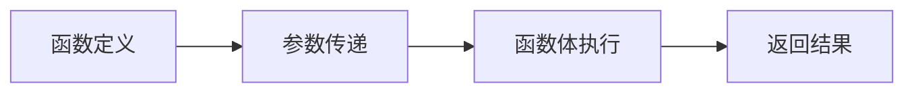

# Markdown Illustrator 用户使用指南

## 目录

- [快速开始](#快速开始)
- [配图规则详解](#配图规则详解)
- [智能模式](#智能模式)
- [使用场景](#使用场景)
- [常见问题](#常见问题)

---

## 快速开始

### 1 分钟上手

```bash
# 最简单的使用方式（智能模式）
python mi.py article.md
```

就这么简单！系统会自动：
- 分析文章内容
- 识别文档类型
- 选择最合适的图片来源
- 生成并插入配图

### 查看效果但不生成图片

```bash
# 只分析不生成（查看会配哪些位置）
python mi.py article.md --dry-run
```

---

## 配图规则详解

系统会根据你的 Markdown 文章结构，自动决定在哪些位置配图。

### 默认配图规则

| 位置 | 条件 | 图片类型 | 说明 |
|-----|------|---------|------|
| H1 标题后 | 有 H1 标题 | 封面图 (cover) | 展示文章主题 |
| H2 标题后 | 有 H2 标题 + 内容 > 100 字 | 章节配图 (section) | 展示章节内容 |
| 段落后 | 段落 >= 150 字 | 氛围插图 (atmospheric) | 匹配内容情绪 |

### 规则示例

假设你有一篇文章：

```markdown
# 深入理解 JavaScript 闭包

闭包是 JavaScript 中最重要的概念之一。

## 什么是闭包

闭包是指有权访问另一个函数作用域中变量的函数。
闭包可以让你从内部函数访问外部函数的作用域。

## 闭包的应用场景

闭包在实际开发中有很多应用场景...
```

**配图结果**：

```
✅ 位置 0 (H1 后) → 封面图
   内容："深入理解 JavaScript 闭包"
   提示词："深入理解 JavaScript 闭包，极简风格，扁平化设计"

✅ 位置 1 (H2 后) → 章节配图
   内容："什么是闭包"
   原因：后续内容约 80 字，不满足 100 字条件
   结果：**不配图** (smart 判断)

❌ 位置 2 (H2 后) → 章节配图
   内容："闭包的应用场景"
   原因：后续内容不足 100 字
   结果：**不配图**
```

### 自定义规则

编辑 `config/settings.yaml`：

```yaml
rules:
  # H1 标题后是否配图
  h1_after: true

  # H2 标题后配图策略
  # - true: 始终配图
  # - false: 不配图
  # - "smart": 智能判断（根据后续内容长度）
  h2_after: "smart"

  # 长段落配图阈值（字数）
  long_paragraph_threshold: 150

  # 两张图片最小间隔段落数
  min_gap_between_images: 3

  # 单篇文章最大配图数
  max_images_per_article: 10
```

---

## 智能模式

智能模式 (`--source auto`) 会自动选择最优的图片来源。

### 工作流程

```
┌─────────────┐
│ 读取文章    │
└──────┬──────┘
       │
       ▼
┌─────────────────┐
│ LLM 文档分类     │
│ (技术/普通)      │
└──────┬──────────┘
       │
       ▼
┌─────────────────────────┐
│ 根据类型选择图片来源       │
├─────────────────────────┤
│ 技术文档 → Mermaid      │
│ 普通文档 → Unsplash     │
│ 封面图   → AI 生成       │
└──────┬──────────────────┘
       │
       ▼
┌─────────────────┐
│ LLM 生成提示词   │
│ (glm-4-flash)   │
└──────┬──────────┘
       │
       ▼
┌─────────────────┐
│ 生成/搜索图片   │
└─────────────────┘
```

### 文档分类标准

**技术文档** 包含以下特征：
- 代码块数量 >= 2
- 技术关键词：函数、算法、API、架构、编程等
- 流程关键词：流程、步骤、循环、判断等
- 结构化程度高（多级标题）

**普通文档** 特征：
- 少量或无代码块
- 主要是叙述性内容
- 关键词偏向生活、情感、描述等

### 图片来源选择

| 文档类型 | 图片类型 | 选择来源 | 理由 |
|---------|---------|---------|------|
| 技术文档 | 任何 | Mermaid | 流程图/序列图更清晰，完全免费 |
| 普通文档 | 章节/氛围 | Unsplash | 真实照片，质量高 |
| 任何类型 | 封面图 | AI (zhipu) | 定制化设计 |

### 示例对比

**技术文档**：

```markdown
# Python 函数基础

def greet(name):
    return f"Hello, {name}!"
```

配图结果：
```markdown
# Python 函数基础


```

**普通文档**：

```markdown
# 春天的美好

春天是一年中最美好的季节。花儿开了，草儿绿了...
```

配图结果：
```markdown
# 春天的美好


*文章封面：春天的美好*

春天是一年中最美好的季节。花儿开了，草儿绿了...
```

---

## 使用场景

### 场景 1: 技术博客

**需求**：为技术教程配图，展示代码结构

**推荐命令**：

```bash
# 智能模式（自动选择 Mermaid）
python mi.py tutorial.md --source auto

# 或直接指定 Mermaid
python mi.py tutorial.md --source mermaid
```

**效果**：
- 封面图：AI 生成主题图
- 章节配图：Mermaid 流程图

### 场景 2: 生活博客

**需求**：为游记、美食、生活方式文章配图

**推荐命令**：

```bash
# 智能模式（自动选择 Unsplash）
python mi.py travel.md --source auto

# 或直接指定 Unsplash
python mi.py travel.md --source unsplash
```

**效果**：
- 封面图：AI 生成主题图
- 内容配图：Unsplash 高质量照片

### 场景 3: 新闻资讯

**需求**：为新闻文章配图，控制成本

**推荐命令**：

```bash
# 使用免费的 Unsplash
python mi.py news.md --source unsplash --batch 3
```

**效果**：
- 为每个位置生成 3 张候选图
- 完全免费

### 场景 4: 产品文档

**需求**：为产品文档配高质量图

**推荐命令**：

```bash
# 使用 Flux.1 高质量生成
python mi.py product.md --source flux
```

**效果**：
- AI 生成高质量插图
- 专业视觉效果

### 场景 5: 批量生成候选图

**需求**：AI 生成效果不稳定，想要多个选择

**推荐命令**：

```bash
# 为每个位置生成 5 张候选图
python mi.py article.md --batch 5 --source zhipu
```

**效果**：
- 每个位置 5 张不同风格的图
- 手动选择最满意的

---

## 常见问题

### Q: 为什么有些 H2 标题后没有配图？

A: 使用默认的 "smart" 模式时，系统会检查后续内容长度。如果不足 100 字，不会配图以避免过度配图。

**解决方法**：
- 在配置中设置 `h2_after: true` 强制所有 H2 后都配图
- 或增加后续内容长度

### Q: 如何控制配图数量？

A: 编辑配置文件中的 `max_images_per_article`：

```yaml
rules:
  max_images_per_article: 5  # 最多 5 张图
```

### Q: 智能模式选择了错误的来源怎么办？

A: 可以手动指定来源：

```bash
# 强制使用 Mermaid
python mi.py article.md --source mermaid

# 强制使用 Unsplash
python mi.py article.md --source unsplash
```

### Q: 如何只重新生成某一张图片？

A: 使用增量更新：

```bash
# 只重新生成第 2 张图片（索引从 0 开始）
python mi.py article.md --regenerate 1

# 重新生成所有封面图
python mi.py article.md --regenerate-type cover
```

### Q: Unsplash 没有找到合适的图片怎么办？

A: 系统会自动使用 AI 生成。或者直接使用 `--source zhipu` 使用 AI。

### Q: 如何查看会配哪些位置，但不实际生成？

A: 使用 dry-run 模式：

```bash
python mi.py article.md --dry-run
```

输出示例：
```
Step 2: 分析内容，决定配图位置...
  文档类型: technical (置信度: 0.85)
  决定配图数量: 2
  #1: [cover] H1 标题后配封面图
      Prompt: Python 函数基础，极简风格...
  #2: [section] H2 标题后配图 (section)
      Prompt: 函数定义，流程图...
```

### Q: Mermaid 图表显示不出来？

A: 确保在支持 Mermaid 的平台查看：
- GitHub 原生支持
- GitLab 原生支持
- 许多 Markdown 编辑器支持
- 或使用 `render_mode: image` 渲染为 PNG

### Q: 如何提高配图与内容的匹配度？

A: 启用 LLM 智能提示词：

```yaml
# config/settings.yaml
llm:
  enabled: true
  provider: zhipu
  model: glm-4-flash
```

### Q: 配图太快了，能否看到生成过程？

A: 使用调试模式：

```bash
python mi.py article.md --debug
```

会显示：
- 文档分类过程
- 提示词生成过程
- 每张图片的生成来源

---

## 进阶技巧

### 技巧 1: 为不同类型文章创建配置

创建多个配置文件：

```bash
# 技术文档使用 tech.yaml
python mi.py tech.md -c config/tech.yaml

# 普通文章使用 blog.yaml
python mi.py blog.md -c config/blog.yaml
```

### 技巧 2: 批量处理多个文件

```bash
# 使用 shell 脚本批量处理
for file in *.md; do
    python mi.py "$file" --source auto
done
```

### 技巧 3: 组合使用 Web 界面

```bash
# 启动 Web 服务器
python src/web_server.py article.md

# 在浏览器中：
# 1. 选择图片来源
# 2. 点击"开始配图"
# 3. 预览效果
# 4. 选择候选图
# 5. 导出文件
```

### 技巧 4: 优化提示词模板

编辑 `config/settings.yaml`：

```yaml
prompts:
  zhipu:
    cover: "{title}，极简风格，白色背景"
    section: "{topic}，流程图，箭头和方框"
```

---

## 总结

### 推荐工作流

```bash
# 1. 写完 Markdown 文章
# article.md

# 2. 使用智能模式配图（推荐）
python mi.py article.md --source auto

# 3. 如果某些图片不满意
python mi.py article.md --regenerate 2 --batch 3

# 4. 查看最终效果
cat article.md
```

### 快速参考

| 需求 | 命令 |
|-----|------|
| 最简单 | `python mi.py article.md` |
| 智能模式 | `python mi.py article.md --source auto` |
| 技术文档 | `python mi.py article.md --source mermaid` |
| 批量候选 | `python mi.py article.md --batch 3` |
| 只看分析 | `python mi.py article.md --dry-run` |
| 重生成某张 | `python mi.py article.md --regenerate 1` |
| Web 界面 | `python src/web_server.py article.md` |

---

## 需要帮助？

- 查看完整文档：`README.md`
- 查看配置示例：`config/settings.yaml`
- 查看示例文件：`examples/`

**祝你使用愉快！** 🎉
